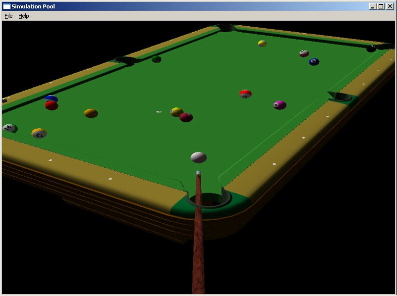
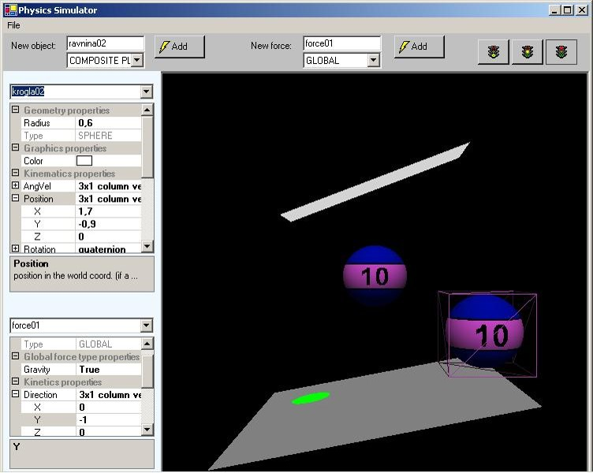

# Physics engine with a pool simulation
The repository contains a physics engine written in c++.
Together with a simple 3D rendering engine (and DirectX), it was used to implement a pool (billiards) simulation.
Code dates back to 2006 and wasn't maintained since. Project would need some updating in order to compile and assemble it for the latest .NET framework and Windows OS.

The Visual Studio solution (SimPool3D.sln) contains two projects, Pool simulation and Physics playground.

## Pool simulation

Physics engine was applied to simulation of a pool game. A full 3D table was designed and defined within the physics engine. No actual pool game rules are supported. 
### Interacting with the simulation
Cue stick can be rotated using the mouse. When "S" key on the keyboard is pressed and held, the screen view locks and the user can move the cue stick towards or away from the cue ball by moving the mouse up or down. 

## Physics Playground

Physics Playground is a simple tool where simulated 2D and 3D entities (planes, boxes, spheres) can be defined interactively. After their definition, the simulation can be run and interactions between entities can be observed in real-time.

## Build environment
The following is required on the build machine:
* Windows 8.1 SDK (http://download.microsoft.com/download/B/0/C/B0C80BA3-8AD6-4958-810B-6882485230B5/standalonesdk/sdksetup.exe)
* DirectX SDK (https://www.microsoft.com/en-us/download/details.aspx?id=6812)
* Windows Universal CRT SDK (can be installed through Visual Studio Installer)

After installing the DirectX SDK, make sure that "$(DXSDK_DIR)Include" has been added to the VC++ Include Directories for both projects.
